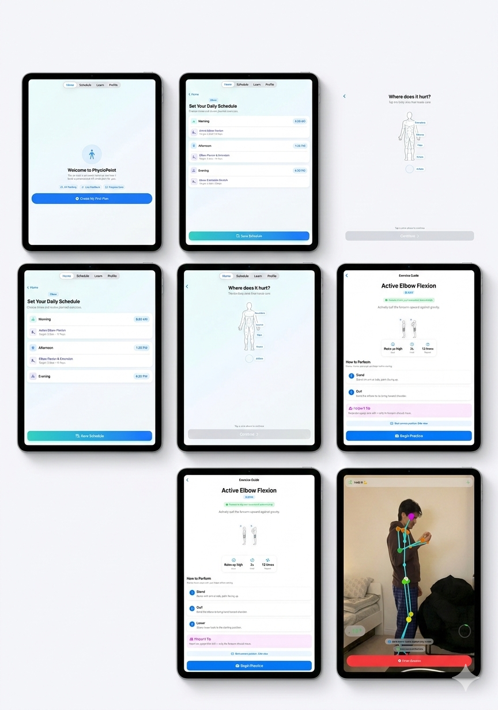

# PhysioPoint - iOS/iPadOS Rehabilitation App

### Apple Swift Student Challenge 2026
> Interested in the Swift Student Challenge? Learn more [here](https://developer.apple.com/swift-student-challenge/).

## Overview
**PhysioPoint** is designed for individuals who need physiotherapy or rehabilitation but face barriers like cost, access, or intimidation around clinical care. It empowers people to begin and maintain recovery on their own terms by providing structured, guided programs that fit seamlessly into their real, busy lives.

## The Problem & Inspiration
**What problem is PhysioPoint trying to solve and what inspired it?**

26% of Canadians have needed physiotherapy and gone without it. The number one reason: they couldn't afford it. A single session costs up to $200 out of pocket, and research shows that people with lower incomes, immigrants, and visible minorities access physiotherapy at significantly lower rates than the general population. This I noticed was the unaffordable barrier for my parents and relatives who suffer from chronic pain. 

My brother-in-law's parents both live with chronic pain from physically demanding jobs. His father has a metal plate in his arm. They manage with YouTube videos, no feedback, no structure, and no clinical oversight. My cousin dislocated his knee, paid $150 per session, and now does those exercises alone with no way to know if his form is safe. Studies show 73% of patients don't complete home exercise programs without guidance—not because they don't want to recover, but because unsupervised rehab is hard to trust.

I wanted to create a way to understand what hurts, build a personalized rehab schedule, and use **ARKit** body tracking to measure joint angles in real time to perform the same assessment a physiotherapist performs manually—because recovery should not depend on what someone can afford.

## Target Audience
**Who would benefit from PhysioPoint and how?**

- **Working Professionals**: For the working professional who spends long hours on their feet only to return home to additional responsibilities, traditional physiotherapy can feel impossible. With limited time and unaffordable $200+ sessions, PhysioPoint offers programs that fit into their schedules so that they can prioritize recovery without sacrificing income and family time.
- **Injured Athletes & Rehab Patients**: For injured athletes without employer benefits or insurance, as well as individuals going through rehabilitation, Apple's ARKit ensures their form meets the same standard as a clinical-grade physiotherapist would enforce, reducing the risk of re-injury and building confidence. Enabling them to complete exercises safely at home without financial strain.
- **Elderly Individuals**: For elderly individuals who find technology intimidating, or perceive rehabilitation as unaffordable, PhysioPoint incorporates an **Accessibility mode**, designed with larger buttons, simpler UX, and guided sessions requiring only an iPad and partner willing to help to make recovery more approachable and manageable.

PhysioPoint removes the barrier to start rehabilitation while supporting, not replacing, traditional physiotherapy care. 

## Accessibility First

Accessibility was the foundation for PhysioPoint and was shaped into every design choice. The target users included elderly individuals, people recovering from serious injuries, and those who simply experience cognitive fatigue during rehabilitation. This demanded a different approach than just building a technically adverse system.

* **Assistive Access Mode**: A dedicated mode completely shifting the UI with custom SwiftUI environment keys to transform the interface into a simpler layout. It scales touch targets to a minimum of **44x44pt** (as per Apple's Human Interface Guidelines), making interactions for users who find standard apps highly overwhelming that much more approachable.
* **Helper Cues**: Acknowledging that most users won’t be alone during AR sessions using the device camera, PhysioPoint provides on-screen cues that prompt the helper to read aloud, guiding the patient to perform the exercises correctly and safely.
* **Plain Language Summaries**: After sessions, a summary page is created to distill the performance into plain language rather than raw data to encourage further steps and add positive reinforcement.
* **VoiceOver Integration**: Fully supports Apple’s VoiceOver and system read-aloud features. This means users who struggle with reading text are also a part of the same guided experience as everyone else.

## On-Device AI Integration

The application uses on-device foundation models which are compiler-gated with `#available` for iOS 26 / Xcode 26. This powers a user AI rehabilitation agent, allowing people to ask direct questions about their pain intelligently. The app also gracefully degrades to a rule-based engine on older systems to ensure all users maintain access to core guidance.

## Core Technologies & Frameworks

- **ARKit (`ARBodyTrackingConfiguration`)**: The core of PhysioPoint. Tracks the full human skeleton in real time, used to verify form through live angle calculations based on the specific exercise being performed.
- **simd Framework**: Apple’s mathematical framework used for processing raw joint positions via vector dot products and cross products, powering the custom `AngleMath.swift` engine.
- **RealityKit**: Renders a 3D wireframe skeleton overlay to give users visual biofeedback, which is critical in understanding how their movements are interpreted during an exercise.
- **SwiftUI**: Drives the entire interface using `NavigationStack`, `EnvironmentObject`, and a custom environment key branch to seamlessly switch the app between standard and assistive access modes without duplication of logic.
- **AppStorage**: Persists all rehab plans on-device without depending on any network requests, serving all plans locally to respect user privacy and independence. 

## Future Iterations
While PhysioPoint is fully functional today, there's an exciting roadmap for continuous improvement to bridge the gap further:
- **AI Integration with WiFi Capabilities**: Enhancing the on-device model with cloud-powered insights when an active connection is present.
- **Robust Exercise Library**: Continually adding tracking profiles for a wider variety of joints and complex rehab movements.
- **Ecosystem Integration**: Reminders with Apple's **ReminderKit**, and deeper scheduling through EventKit and native Calendars.
- **Immersive Rehabilitation**: Advanced **RealityKit** integrations to transform mundane environments into immersive, supportive workout spaces.
- **Recording & Playback**: The ability to record AR sessions, save them securely, and watch later to self-correct or share progress with a physical therapist.

## Credits 
Made by Rajan Chavada 
February, 28, 2026

## License
PhysioPoint is licensed under the MIT License.
